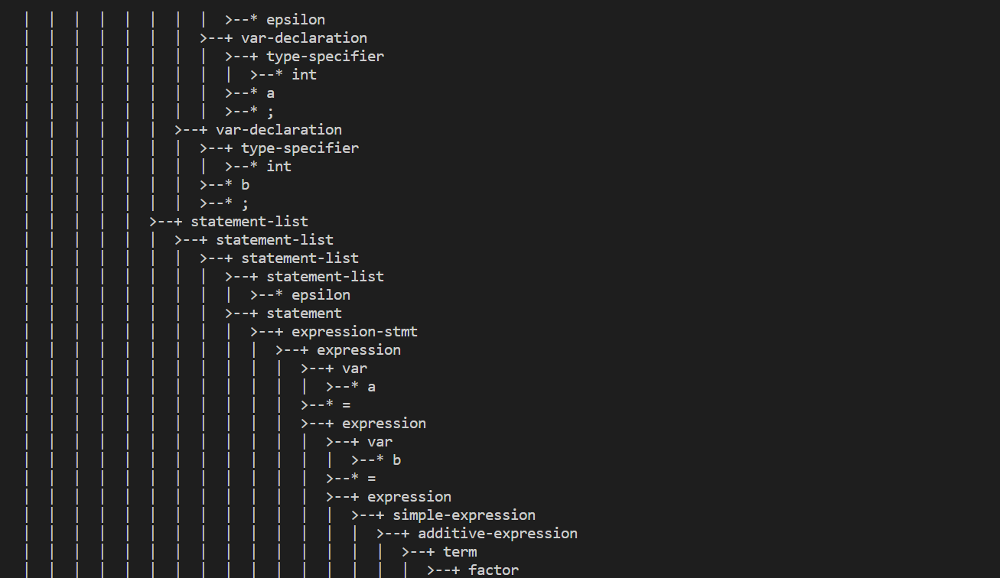

# lab2 实验报告

学号 PB18111733 姓名 蒲明昱

## 实验要求

需要首先将 lab1 的词法部分复制到 `/src/parser` 目录的 [lexical\_analyzer.l](./src/parser/lexical\_analyzer.l)并合理修改相应部分，然后根据 `cminus-f` 的语法补全 [syntax\_analyer.y](./src/parser/syntax_analyzer.y) 文件，完成语法分析器，要求最终能够输出解析树。

## 实验难点

1. 理解token和type的区别，token用于定义终结符，type用于定义非终结符

2. 成功编译通过之后，遇到所有语法树都无法输出的问题。经多次尝试后(大概是那么好几个小时qwq)，发现是空格和换行符处理有误，在.l文件中，仍保留return BLANK语句，所以导致有误。

3. 理解yylval的数据结构：尝试在gitlab上回答了思考题，但是之后没有更深的理解，通过阅读后面同学回答的思考题，才对这个数据结构有了完整的了解。

## 实验设计

对parser文件夹下的lexical_analyzer.l和syntax_analyzer.y文件做修改。因为两个文件中助教都有给出示例代码，所以根据示例代码加以扩充即可。唯一需要自己思考的地方就是token和type的使用，一个用于定义终结符，另一个用于定于非终结符。

.l文件中定义的为非终结符，在.y文件中用token声明，其余的多视为非终结符

对之前实验一的代码进行复制（注意%%也要一起复制，不然不符合文法），然后对部分做修改，关注命名问题是否不同，还有comment，blank等不用return。

## 实验结果验证

1. 对助教给出的test和normal验证如下：


可以看出，运行diff语句没有输出，即说明验证通过，没有出错。

2. 通过修改助教的testcase形成自己的testcase：test.cminus：

```
/*
    I AM HAPPY TODAY
*/

int array[2/*balabal*/];/*添加特殊注释*/


int main(void){

    int a; int b;

    a = b = 84.;/*用特殊小数*/

    if(a = b){
        array[ ( MyFunc() ) ] = array[c = /*.....*/1.*.1 /*......*/ == 1.1];/*添加特殊注释*/
    }


    return 0.;
}

```

输出语法树如下图:(由于语法树过长，所以仅截取关键部分)





通过输出的语法树可以判断自己的testcase的正确性


## 实验反馈

助教的文档非常清晰，基本跟着做就可以。debug的过程耗费了蛮久的时间（主要是语法树没有输出不知道从哪里debug那里）。通过lab2，对flex和bison有了更进一步的了解。