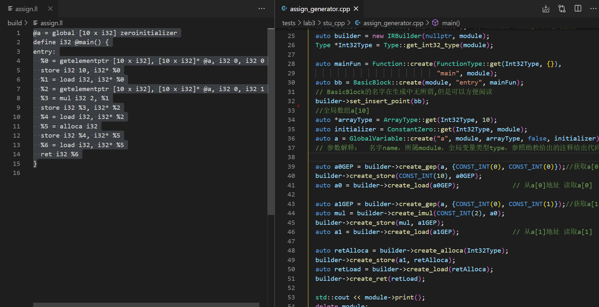
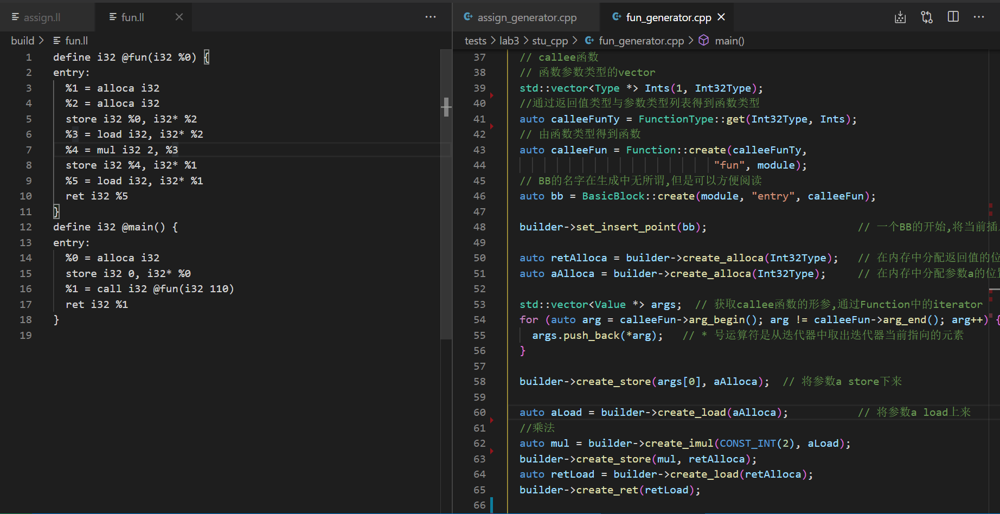
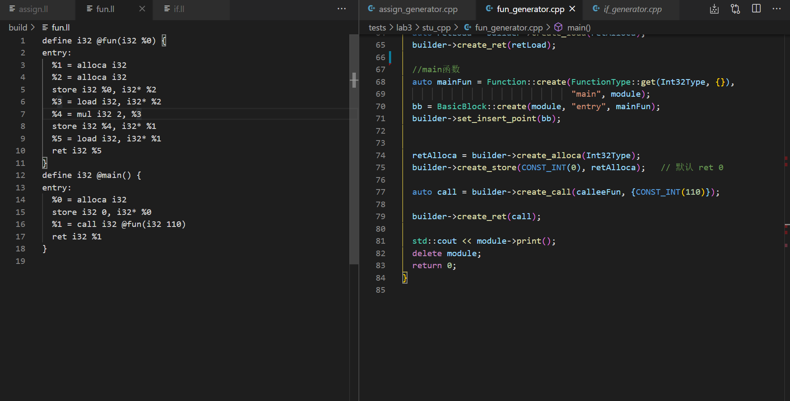
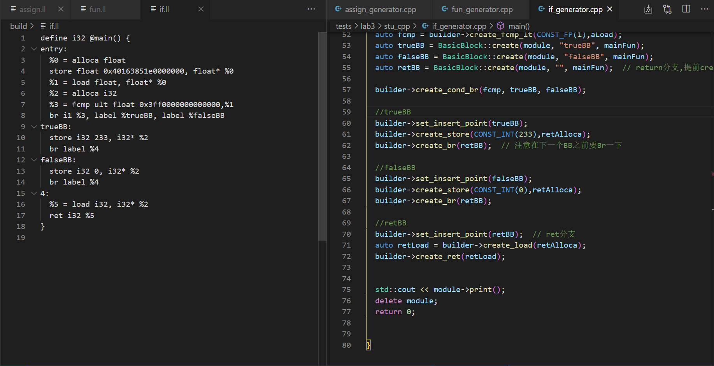
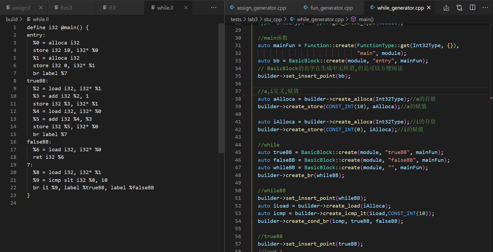
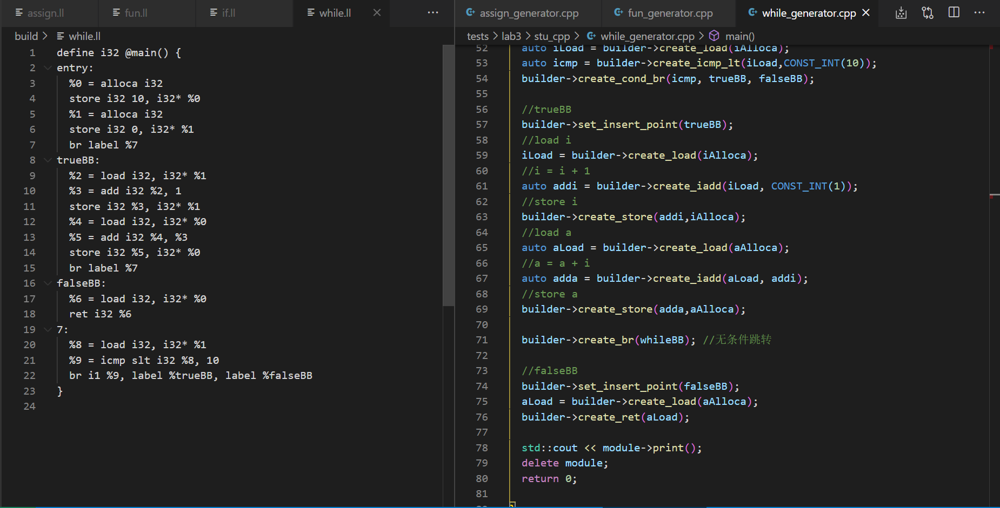
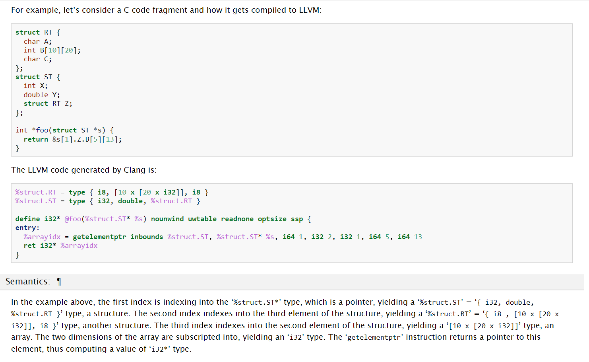

# lab3 实验报告
学号 姓名
PB18111733 蒲明昱

## 问题1: cpp与.ll的对应
请描述你的cpp代码片段和.ll的每个BasicBlock的对应关系。描述中请附上两者代码。

1. assign.c

32-51行对应entry

2. fun.c

第一个entry对应37-56行callee函数

第二个entry对应67-79行main函数

3. if.cd

第一个entry对应38-57行

trueBB对应于59-62行

false对应于64-67行

retBB对应于69-72行

4. while.c

entry对应于31-48行

whileBB对应于50-54行

trueBB对应于56-71行

falseBB对应于73-76行

## 问题2: Visitor Pattern
请指出visitor.cpp中，`treeVisitor.visit(exprRoot)`执行时，以下几个Node的遍历序列:numberA、numberB、exprC、exprD、exprE、numberF、exprRoot。  
序列请按如下格式指明：  
exprRoot->numberF->exprE->numberA->exprD

答：在思考此问题时，先对C++一些不了解的用法做了查阅，在读懂代码的基础上，即较容易找出遍历序列。

exprRoot->numberF->exprE->exprD->numberB->numberA->exprC->numberA->numberB

## 问题3: getelementptr
请给出`IR.md`中提到的两种getelementptr用法的区别,并稍加解释:
  - `%2 = getelementptr [10 x i32], [10 x i32]* %1, i32 0, i32 %0` 
  - `%2 = getelementptr i32, i32* %1 i32 %0` 
答：

助教已经给出关于GetElementPtr的基本用法讲解，在 `<result> = getelementptr <type>, <type>* <ptrval> [, <type> <idx>]`中 

 第一个参数是计算基础类型，第二第三个参数表示索引开始的指针类型及指针，`[]`表示可重复参数，里面表示的数组索引的偏移类型及偏移值。

根据此用法，对比上面两行写法，可以找出**区别**为： 

指针类型为`[10 x i32]`的指针有两组**可重复参数**，为`i32 0`和`i32 %0`；

指针类型为`i32`的指针有一组**可重复参数**，为`i32 0`。

完成试验后，结合参考文档里的示例（如下图）和同学发的issue，得到使用方式的差异。

如上图，使用了五组**可重复参数**，每个参数的意义在文档中解释的十分详细。分析得到，getelementptr在获取数组结构的元素地址时，可重复参数的数目是由指针类型决定的。

1.对于数组和结构体来说，第一个参数为要进行计算的原始指针，往往是一个结构体指针，或数组首地址指针。

对于助教给出的代码：

`%2 = getelementptr [10 x i32], [10 x i32]* %1, i32 0, i32 %0`

第一个0即为数组首地址指针；

对于贴图中的示例：

`%arrayidx = getelementptr inbounds %struct.ST, %struct.ST* %s, i64 1, i32 2, i32 1, i64 5, i64 13`

第一个参数i64 1,即代表结构体指针，指向第二个结构体。对应于`&s[1].Z.B[5][13]`中的`s[1]`

第二个参数及以后的参数，都称为`indices`，表示要进行计算的参数，如结构体的第几个元素，数组的第几个元素。

2.对于助教给出的第二个示例，

`%2 = getelementptr i32, i32* %1, i32 %0` 

指针类型为`i32`，所以不需要第一个指向数组首地址的指针，直接用参数表示偏移量即可。

## 实验难点
描述在实验中遇到的问题、分析和解决方案

三个问题还是比较难qwq。

分析：em.....确实这些知识都比较陌生

解决方案：查官方文档，查CSDN，反复阅读助教的文档qwq

## 实验反馈
吐槽?建议?
没吐槽！特别好！
（ddl要到了来不及了，这个不写应该不会扣分吧）