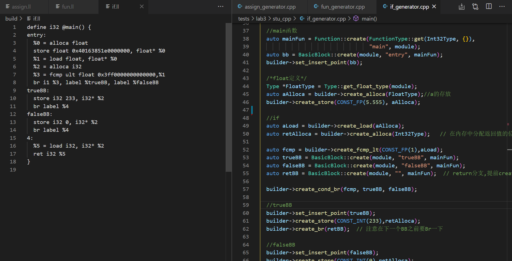

# lab3 实验报告
学号 姓名
PB18111733 蒲明昱

## 问题1: cpp与.ll的对应
请描述你的cpp代码片段和.ll的每个BasicBlock的对应关系。描述中请附上两者代码。

对应关系分别如下，cpp的具体写法详见注释
1. assign.c


32-51行对应entry


2. fun.c


第一个entry对应37-56行callee函数


第二个entry对应67-79行main函数


3. if.cd


第一个entry对应38-57行





trueBB对应于59-62行

false对应于64-67行

retBB对应于69-72行


4. while.c


entry对应于31-48行

whileBB对应于50-54行


trueBB对应于56-71行


falseBB对应于73-76行


## 问题2: Visitor Pattern
请指出visitor.cpp中，`treeVisitor.visit(exprRoot)`执行时，以下几个Node的遍历序列:numberA、numberB、exprC、exprD、exprE、numberF、exprRoot。  
序列请按如下格式指明：  
exprRoot->numberF->exprE->numberA->exprD

答：在思考此问题时，先对C++一些不了解的用法做了查阅，在读懂代码的基础上，即较容易找出遍历序列。

exprRoot->numberF->exprE->exprD->numberB->numberA->exprC->numberA->numberB

查阅相关资料，整理出不懂的概念如下;

##### 引用

在visitor.cpp中出现了&

引用变量本质上是指针的另一个名字

```c++
void main(void) 
{ 
int i=3;
f(i); 
cout << i; 
}
void f(int& r) 
{ 
r = 2*r; 
}
```

网上搜索的这个程序很好的体现了引用的含义，该程序输出结果为6

##### 虚函数（virtual）

同样是 p->fun();但结果不一样。

在子类中进行改写不影响原函数

示例程序如下：

```c++
class A
{
virual fun()
{cout<<"a"<<endl;}
}
class B : public A
{
virual fun() //在子类中改写
{cout<<"B"<<endl;}
}
class C: public A
{
virual fun() //在子类中改写
{cout<<"C"<<endl;}
}
int main()
{
A * p ;
B mb;
C mc;
p=&mb;
p->fun();//输出B
p=&mc;
p->fun();//输出C
return 0;
}
```


##### 纯虚函数

如果想要在基类中定义虚函数，但是在基类中又不能对虚函数给出有意义的实现，这个时候就会用到纯虚函数。

```c++
class Node {  // Parent class for the elements (AddSubNode, NumberNode and
              // MulDivNode)
 public:
  // This function accepts an object of any class derived from
  // TreeVisitor and must be implemented in all derived classes
  virtual int accept(TreeVisitor& treeVisitor) = 0; //纯虚函数
};
```

 `= 0` 告诉编译器，函数没有主体，上面的虚函数是**纯虚函数**。 

 还出现了一个关键字为override，也是与基类和子类对函数的定义有关的，不影响对遍历顺序的理解，故不做详细探究

## 问题3: getelementptr
请给出`IR.md`中提到的两种getelementptr用法的区别,并稍加解释:
  - `%2 = getelementptr [10 x i32], [10 x i32]* %1, i32 0, i32 %0` 
  - `%2 = getelementptr i32, i32* %1 i32 %0` 
答：

助教已经给出关于GetElementPtr的基本用法讲解，在 `<result> = getelementptr <type>, <type>* <ptrval> [, <type> <idx>]`中 

 第一个参数是计算基础类型，第二第三个参数表示索引开始的指针类型及指针，`[]`表示可重复参数，里面表示的数组索引的偏移类型及偏移值。

根据此用法，对比上面两行写法，可以找出**区别**为： 

指针类型为`[10 x i32]`的指针有两组**可重复参数**，为`i32 0`和`i32 %0`；

指针类型为`i32`的指针有一组**可重复参数**，为`i32 0`。

完成试验后，结合参考文档里的示例（如下图）和同学发的issue，得到使用方式的差异。


如上图，使用了五组**可重复参数**，每个参数的意义在文档中解释的十分详细。分析得到，getelementptr在获取数组结构的元素地址时，可重复参数的数目是由指针类型决定的。

1.对于数组和结构体来说，第一个参数为要进行计算的原始指针，往往是一个结构体指针，或数组首地址指针。

对于助教给出的代码：

`%2 = getelementptr [10 x i32], [10 x i32]* %1, i32 0, i32 %0`

第一个0即为数组首地址指针；

对于贴图中的示例：

`%arrayidx = getelementptr inbounds %struct.ST, %struct.ST* %s, i64 1, i32 2, i32 1, i64 5, i64 13`

第一个参数i64 1,即代表结构体指针，指向第二个结构体。对应于`&s[1].Z.B[5][13]`中的`s[1]`

第二个参数及以后的参数，都称为`indices`，表示要进行计算的参数，如结构体的第几个元素，数组的第几个元素。

2.对于助教给出的第二个示例，

`%2 = getelementptr i32, i32* %1, i32 %0` 

指针类型为`i32`，所以不需要第一个指向数组首地址的指针，直接用参数表示偏移量即可。


## 实验难点
描述在实验中遇到的问题、分析和解决方案

三个问题还是比较难qwq。

分析：em.....确实这些知识都比较陌生

解决方案：查官方文档，查CSDN，反复阅读助教的文档qwq


## 实验反馈
吐槽?建议?
没吐槽！特别好！
（ddl要到了来不及了，这个不写应该不会扣分吧）