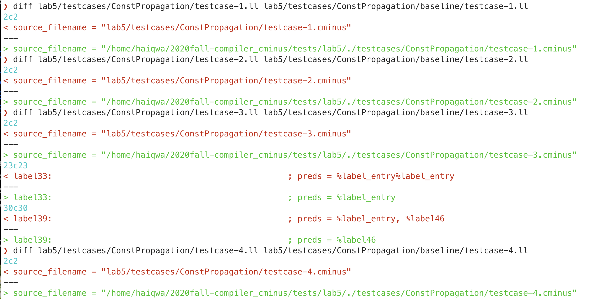
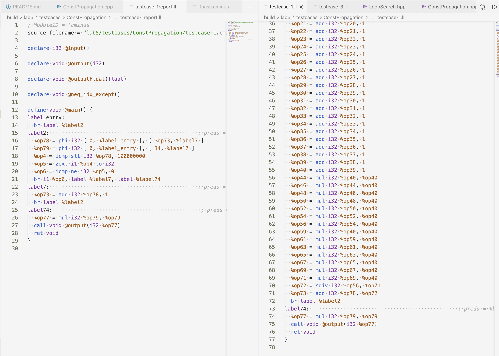
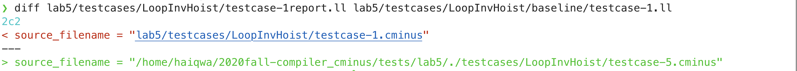
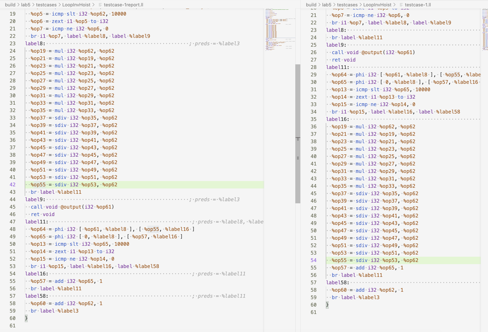
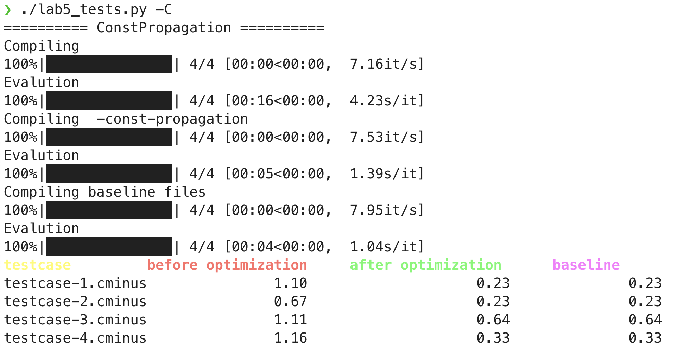
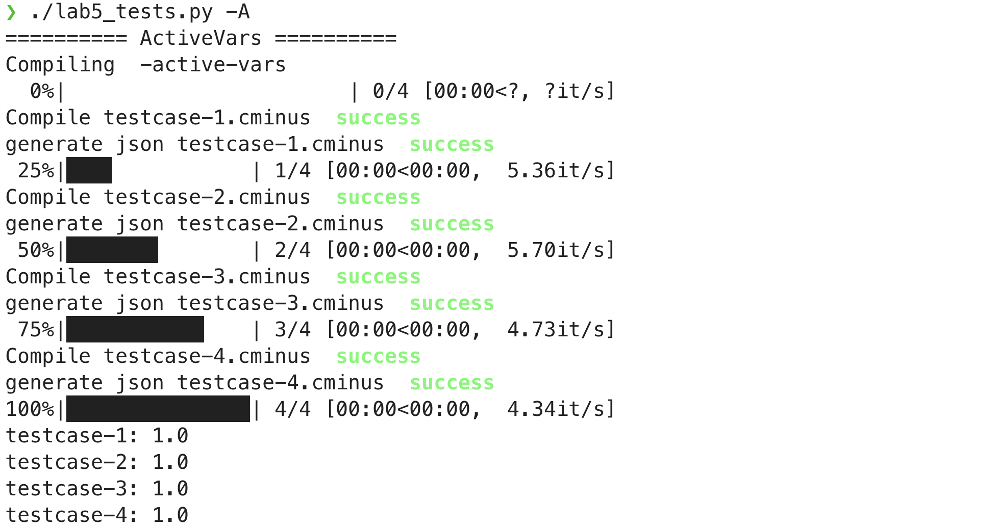

# Lab5 实验报告

小组组长 蒲明昱 PB18111733 
小组成员 钟溯飏 PB18111764

## 实验要求

开发基本优化pass，完成三个优化内容
- 常量传播：需要把在编译期间就能确定为常量的所有变量，全部换成常量，然后删除冗余代码；同时如果有确定不会跳转到的branch，也需要删除。
- 循环不变式外提：将循环里不会发生改变，并且其提出循环不会对其他值造成影响的表达式提出循环，提升运行速度。
- 活跃变量分析：通过对每个bb进行def和use的计算，通过书上数据流迭代算法，迭代计算出live_in,live_out集合

## 实验难点

- 常量传播：因为是最后写的，基本无难点，硬要说的话，就是如何删除冗余if/else和维护phi指令
- 循环不变式外提：如何提取loop，如何正确顺序遍历loop内的bb，以及如何确定bb内的instr能否被提出。
- 活跃变量：如何处理phi结点来自不同路径的活跃性。

## 实验设计

#### 常量传播
##### 实现思路
模仿助教的整形`compute()`，重载一个浮点数的`compute()`，并类似增添两个`compare()`用以处理常数间的比较。然后为ConstFolder类实现`replace_const()`和`clear_redundancy()`，分别用来替换某函数内所有常量和删除所有冗余块。在`run()`中，迭代m_里所有function调用这两个函数就行。其中，`replace_cosnt()`和`clear_redundancy()`具体描述实现代码如下（为方便助教观看，对一些函数有折叠）

##### 相应代码

```cpp
void ConstFolder::replace_const(Function *f) {
    std::vector<Instruction *> wait_delete;
    for (auto bb : f->get_basic_blocks()) {
      //用于判断块内全局变量，如果有store常数行为，就放到这个map里
        std::unordered_map<Value *, Value *> vGlobal;
        for (auto instr : bb->get_instructions()) {
            bool allConst = false; //如果这条指令是所有op都是常数，allConst=true，默认是false
            if (instr->isBinary()) {
              //获取指令
                Value *oper0, *oper1;
                auto opID = instr->get_instr_type();
                oper0 = instr->get_operand(0);
                oper1 = instr->get_operand(1);
              //对整形和浮点数指令分开考虑
                if (oper0->get_type()->is_float_type()) {
                    auto constFP0 = cast_constantfp(oper0);
                    auto constFP1 = cast_constantfp(oper1);
                  //两个oper都是常数，allConst为真
                    allConst = constFP0 != nullptr && constFP1 != nullptr;
                    if (allConst) {
                        auto ans = compute(opID, constFP0, constFP1);
                      //计算并进行替换
                        instr->replace_all_use_with(ans);
                    }
                } else if (oper0->get_type()->is_integer_type()) {...}//float类似，这里折叠
            }
          //如果是类型转换，也要做替换
            if (instr->is_fp2si()) {
                Value *oper;
                oper = instr->get_operand(0);
                auto constFP = cast_constantfp(oper);
              //fp2si只有一个操作数
                allConst = constFP != nullptr;
                if (allConst) {
                  //使用ConstantInt::get以及编译器内置类型转换进行转换。
                    auto ans = ConstantInt::get((int)(constFP->get_value()), module_);
                    instr->replace_all_use_with(ans);
                }
            }
            if (instr->is_si2fp()) {... }//与fp2si类似，折叠
            if (instr->is_cmp()) {
                Value *oper0, *oper1;
                auto cmpInst = static_cast<CmpInst *>(instr);
              //通过get_cmp_op获取cmp指令比较符号
                auto opID = cmpInst->get_cmp_op();
                oper0 = instr->get_operand(0);
                oper1 = instr->get_operand(1);
                auto constInt0 = cast_constantint(oper0);
                auto constInt1 = cast_constantint(oper1);
                allConst = constInt0 != nullptr && constInt1 != nullptr;
                if (allConst) {
                  //调用类似compute借口，直接进行常数比较并返回值。
                    auto ans = compare(opID, constInt0, constInt1);
                    instr->replace_all_use_with(ans);
                }
            }
            if (instr->is_fcmp()) {...}//与cmp类似，折叠
            if (instr->is_zext()) {...}//与fp2si类似
            if (instr->is_store()){
              Value *rval, *lval;
                rval = instr->get_operand(0);
                lval = instr->get_operand(1);
              //分类讨论store的是哪个（因为要判断是整形还是浮点数常数）
              //实际上不分类也可以
                if (rval->get_type()->is_integer_type()) {
                    auto constInt = cast_constantint(rval);
                    if(constInt != nullptr){
                        vGlobal.insert({lval, rval});
                    }
                } else if (rval->get_type()->is_float_type()) {...} //类似
            }
            if(instr->is_load()){
              Value *lval;
              //获取需要load的变量，并判断是否在map:vGlobal里
                lval = instr->get_operand(0);
                if(vGlobal.find(lval)!=vGlobal.end()){
                    allConst = true;
                    auto value = vGlobal[lval];
                    instr->replace_all_use_with(value);
                }
            }
            if (allConst) {
                wait_delete.push_back(instr);
            }
        }
        //删除需要删除的instr
        for (auto instr : wait_delete) {
            bb->delete_instr(instr);
        }
    }
}
void ConstFolder::clear_redundancy(Function *f) {
  //为类新增一个redundantBBs这个unordered_set，用以在遍历后删除
    redundantBBs.clear();
    for (auto bb : f->get_basic_blocks()) {
        BasicBlock *nextBB = nullptr;
        std::vector<Instruction *> wait_delete;
        if (redundantBBs.find(bb) != redundantBBs.end()) {
            continue;
        }
        auto term = bb->get_terminator();
      //判断这个bb的终结指令是不是cond_br以及cond是否已经确定为true或false
      //具体流程为is_br()=>static_cast=>is_cond_br()=>get_operand()=>cast_constantint()
        if (term->is_br()) {
            auto brTerm = static_cast<BranchInst *>(term);
            if (brTerm->is_cond_br()) {
                auto flagValue = brTerm->get_operand(0);
                auto flag = cast_constantint(flagValue);
                if (flag != nullptr) {
                  //如果flag是确定的，那么通过operand位置判断应该前往和应该删除哪个（些）bb
                    BasicBlock *brBB, *uselessBB;
                    if (flag->get_value()) {
                        brBB = static_cast<BasicBlock *>(brTerm->get_operand(1));
                        uselessBB = static_cast<BasicBlock *>(brTerm->get_operand(2));
                    } else {...}
                  //进行traverseBranch遍历那个需要删除的bb，加入到redundantBBs，返回出口bb
                    nextBB = traverseBranch(uselessBB, 1);
                  //更改cond_br为br
                    bb->delete_instr(brTerm);
                    auto brInst = BranchInst::create_br(brBB, bb);
                }
            }
        }
      //如果nextBB存在（即删除了一些bb），对nextBB的phi结点进行额外的处理。
      //具体思路为：如果有来自被删除bb的label，就把这个phi删除，用另一个oper进行replace_all_use
        if (nextBB != nullptr) {
            for (auto instr : nextBB->get_instructions()) {
                if (instr->is_phi() && instr->get_num_operand() == 4) {
                    auto oper0 = instr->get_operand(0);
                    auto label0 = instr->get_operand(1);
                    auto oper1 = instr->get_operand(2);
                    auto label1 = instr->get_operand(3);
                    auto bb0 = static_cast<BasicBlock *>(label0);
                    auto bb1 = static_cast<BasicBlock *>(label1);
                    if (redundantBBs.find(bb0) != redundantBBs.end() && redundantBBs.find(bb1) == redundantBBs.end()) {
                        auto ans = oper1;
                        wait_delete.push_back(instr);
                        instr->replace_all_use_with(oper1);
                    }
                    if (redundantBBs.find(bb1) != redundantBBs.end() && redundantBBs.find(bb0) == redundantBBs.end()) {...}
                }
            }
        }
      //删除phi
        for (auto instr : wait_delete) {
            nextBB->delete_instr(instr);
        }
    }
  //删除bb
    for (auto bb : redundantBBs) {
        f->remove(bb);
    }
}
//对某条路径开始的结点进行遍历，不断加入冗余块set，并返回出口结点
BasicBlock *ConstFolder::traverseBranch(BasicBlock *bb, int depth) {
    if (depth == 1 && bb->get_pre_basic_blocks().size() == 2) {
        return bb;
    }
    redundantBBs.insert(bb);
    if (bb->get_pre_basic_blocks().size() == 2) {
        depth -= 1;
    }
    if (bb->get_succ_basic_blocks().size() == 2) {
        depth += 1;
    } else if (bb->get_succ_basic_blocks().size() == 0) {
        return nullptr;
    }
    BasicBlock *exit = nullptr;
    for (auto nextbb : bb->get_succ_basic_blocks()) {
        exit = traverseBranch(nextbb, depth);
    }
    return exit;
}
```

##### 优化前后的IR对比

可见自己生成的IR和baseline生成的，除了注释信息，都是一样的



以下举testcase1为例：



简单来说就是把有常数表达式的结果直接算出来，并且将所有左值出现的地方替换为该常数。并且在替换后将可能新产生的常数表达式继续进行替换。

#### 循环不变式外提

##### 实现思路

首先经过深度优先迭代，将迭代loop的顺序进行确定，即放进栈里，外层循环（包含小循环）先入栈，小循环后入栈。然后遍历的时候，不断出栈，完成顺序遍历。

每次弹出一个循环，对其进行循环不变式计算：首先把base的所有phi结点丢进循环**变**式`unInvHoist`里面，这些phi是某些在循环外和内都有定值的值，因此不能确定是循环不变式。然后对其余bb进行迭代，把phi，cmp/fcmp，放进其中，以及这些循环变式若在等式右边出现，也会是一个循环变式。以此类推。接下来对bb进行迭代，首先忽略掉其中的if/else或小循环，可以提高速度。然后去迭代每个指令，如果是Binary指令，才继续去判断是不是循环不变式。

此时循环判断Binary的操作数，如果有一个oper在循环变式里，就不可以动它，否则入栈，准备将其前移（缓存最后一个terminal指令，删除它，add所有前移指令，重新加上terminal指令）。前移的bb块为`bb4move`，通过判断前驱是否在这个loop里来确定。

##### 相应代码（只展示关键部分）

判断前移到哪个前驱：

```cpp
for (auto bb : base->get_pre_basic_blocks()) {
    if (loop->find(bb) == loop->end()) {
        bb4move = bb;
        break;
    }
}
```

如何确定循环**变**式：

先把整个循环头部的phi加入，即这个循环里会被定值，并且会循环用（即变量）的表达式。

然后循环加入那些一定不可以前移的表达式，比如比较。

如果在某表达式的右值出现了循环变式，那么代表这个式子产生依赖，不可以外提，也要加进去。

```cpp
for (auto instr : base->get_instructions()) {
    if (instr->is_phi()) {
        UnInvHoist.insert(instr->get_name());
    }
}
for (auto bb = loop->begin(); bb != loop->end(); bb++) {
    if (std::count(DFSStack.begin(), DFSStack.end(), (loop_searcher.get_inner_loop(*bb)))) {
        continue;
    }
    for (auto instr : (*bb)->get_instructions()) {
        if (instr->is_phi() || instr->is_fcmp() || instr->is_cmp()) {
            UnInvHoist.insert(instr->get_name());
        } else if (instr->isTerminator() || instr->is_gep() || instr->is_load() || instr->is_store()) {
            continue;
        }
        int opNum = instr->get_num_operand();
        for (int i = 0; i < opNum; i++) {
            auto tmpV = instr->get_operand(i);
            if (UnInvHoist.find(tmpV->get_name()) != UnInvHoist.end()) {
                UnInvHoist.insert(instr->get_name());
                break;
            }
        }
    }
}
```

##### 优化前后的IR对比





这里就是将从%op19-%op57（`ret = (i*i*i*i*i*i*i*i*i*i)/i/i/i/i/i/i/i/i/i/i`）从bb16前移到了bb8里，因为后面那一长串的取值都与整个循环无关，且外提没有副作用。

#### 活跃变量分析

##### 实现思路

首先迭代每个bb，迭代每个instr，计算每个bb的use和def集合：将所有指令的右值，除了常数，函数名，label名都加到use[bb]里面，将phi指令的操作数加到phiUse[bb]里，以及其对应前驱(label)的phiOut[bb]里，即标记出这个op的活跃性应该从哪条分支继承。这样做标记方便接下来的数据流分析额外对其作考虑。而def集合则是加入所有phi, Binary, load, alloca, call, gep本身（即左值）。

数据流分析：基本按照书上的迭代算法。

- `live_out[bb]`等于其后继的IN的并集。如果发现某个操作数是因为phi结点产生的IN的活跃性，即在phiUse里面找到了这个oper，那么还需要判断phiOut[bb]是不是这个bb，如果不是，则不能加入这个op。
- `Live_in[bb]`先加入`useB[bb]`，再去迭代`live_out[bb]`，如果不在`defB[bb]`里，则加入，否则不加入。
- 维护tmpIn缓存迭代前的live_in，然后看`live_in`的每个元素是否在tmpIN里，从而看有无改变。

##### 相应的代码：

对use的计算

```cpp
auto oper = instr->get_operand(i); //迭代指令的每个值
if (cast_constantfp(oper) != nullptr || cast_constantint(oper) != nullptr) {
    continue;//舍去常数
}
if (tmpDef.find(oper) == tmpDef.end()) {
    auto opType = oper->get_type();
    if (!opType->is_function_type() && !opType->is_label_type()) {
      //舍去function和label
        useB[bb].insert(oper);
        if (instr->is_phi()) {
          //标注这个oper是phiUse来的
            phiUseB[bb].insert(oper);
            auto oriBB = instr->get_operand(i + 1);
            for(auto preBB:bb->get_pre_basic_blocks()){
                if(preBB->get_name() == oriBB->get_name()){
                  //标注前一个bb这个oper从这来的
                    phiOutB[preBB].insert(oper);
                }
            }
        }
    }
}
```

对def的计算

```cpp
if (instr->is_phi() || instr->isBinary() || instr->is_load() || instr->is_call() || instr->is_gep() || instr->is_alloca()) {
    defB[bb].insert(instr);
}
```

对`live_out[bb]`的计算

```cpp
for (auto succ_bb : bb->get_succ_basic_blocks()) {
    for (auto oper = live_in[succ_bb].begin(); oper != live_in[succ_bb].end(); oper++) {
        //看看是不是在交叉边
        if (phiUseB[succ_bb].find(*oper) != phiUseB[succ_bb].end() && phiOutB[bb].find(*oper) == phiOutB[bb].end()) {
            continue;
        }
        live_out[bb].insert(*oper);
    }
}
```

对`live_in[bb]`的计算

```cpp
live_in[bb].insert(useB[bb].begin(), useB[bb].end());
for (auto v = live_out[bb].begin(); v != live_out[bb].end(); v++) {
    if (defB[bb].find(*v) == defB[bb].end()) {
        live_in[bb].insert(*v);
    }
}
```

### 实验总结

- 更加了解了stl的使用
- 对编译优化有了更深一步的认识
- 有的时候想不到某段程序怎么写应该站起来呼吸一下新鲜空气；想不出bug的原因应该下楼去取外卖。
- 以下附三个pass的结果






### 实验反馈 （可选 不会评分）

对本次实验的建议

### 组间交流 （可选）

本次实验和哪些组（记录组长学号）交流了哪一部分信息
